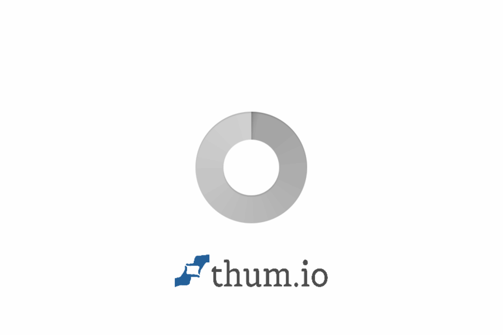
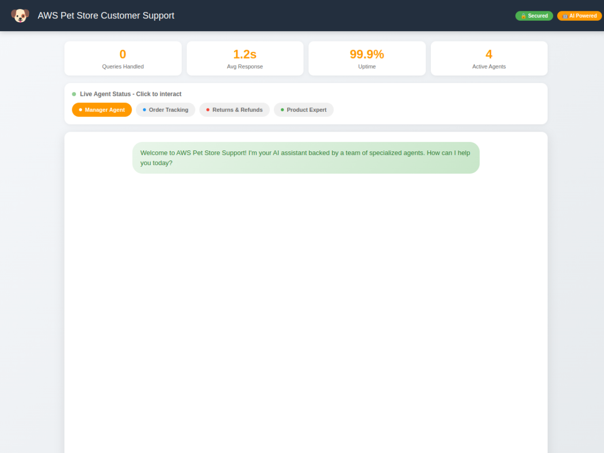

# AWS AI BUILDER HACKATHON LAB: CRAFT WITH AI AND BUILD WITH AI
## (AWS Pet Store Customer Support)

> Multi-Agent Customer Support System for AWS Pet Store using Lyzr, AWS Bedrock, and Modern AI Infrastructure

[](https://dxoecztual878.cloudfront.net/)
[](https://aws.amazon.com/)
[](https://lyzr.ai/)

---

## Overview

This project implements an **enterprise-grade AI customer support system** for AWS Pet Store using a **multi-agent architecture**. The system intelligently routes customer queries to specialized agents for order tracking, returns processing, and product recommendations.

### Key Features

- **Multi-Agent Architecture**: Manager agent coordinates 3 specialist agents
- **Intelligent Query Routing**: Automatic routing based on customer intent
- **Real-time Order Tracking**: Integration with AWS Lambda for order lookups
- **Smart Product Recommendations**: Vector-based search for personalized suggestions
- **Enterprise Security**: AWS Bedrock Guardrails for content safety
- **Modern Infrastructure**: Coder workspaces with MCP server integration

---

## Screenshots

### Homepage - Multi-Agent Chat Interface


### Chat Interface with Agent Panel


---

## Architecture


### System Flow

```
Customer Query → CloudFront → Manager Agent → Route to Specialist
                                    ↓
              ┌─────────────────────┼─────────────────────┐
              ↓                     ↓                     ↓
     Order Tracking Agent    Returns Agent       Product Info Agent
              ↓                     ↓                     ↓
        Lambda (Orders)      Lambda (Returns)     Qdrant Knowledge Base
              ↓                     ↓                     ↓
              └─────────────────────┼─────────────────────┘
                                    ↓
                          Response to Customer
```

---

## AWS Services Used

| Service | Purpose | Use Case |
|---------|---------|----------|
| **Amazon CloudFront** | Content Delivery | Global distribution of web application with low latency |
| **Amazon S3** | Static Hosting | Store and serve the customer support chat interface |
| **AWS Bedrock** | LLM Foundation | Powers AI responses using Claude 3.5 Sonnet model |
| **Bedrock Guardrails** | Content Safety | Filters harmful content, blocks prompt injections |
| **AWS Lambda** | Serverless Compute | Order tracking and returns processing functions |
| **API Gateway** | REST API | Expose Lambda functions as HTTP endpoints |
| **IAM** | Access Control | Secure service-to-service authentication |

---

## Multi-Agent Architecture

### Manager Agent
| Component | Description |
|-----------|-------------|
| **Role** | Query Router & Coordinator |
| **Function** | Analyzes customer intent and routes to appropriate specialist |
| **Routing Logic** | Order queries → Order Agent, Return queries → Returns Agent, Product queries → Product Agent |

### Specialist Agents

| Agent | Role | Tool | Knowledge Base |
|-------|------|------|----------------|
| **Order Tracking Agent** | Track shipments, delivery status | `track_order` | Shipping policies |
| **Returns Agent** | Process returns, refunds | `process_return` | Returns policies |
| **Product Info Agent** | Recommendations, pricing | `search_products` | Product catalog |

---

## Technology Stack

### AI & ML
- **Lyzr Agent Studio** - Multi-agent orchestration platform
- **AWS Bedrock** - Foundation model hosting (Claude 3.5 Sonnet)
- **Qdrant** - Vector database for semantic search
- **Sentence Transformers** - Text embeddings (all-MiniLM-L6-v2)

### Infrastructure
- **Coder** - Cloud development environments
- **Pulumi** - Infrastructure as Code
- **LaunchDarkly** - Feature flag management

### Observability
- **Arize** - LLM observability and tracing
- **LlamaIndex** - RAG framework integration

---

## MCP Server Integration

| MCP Server | Purpose |
|------------|---------|
| **Pulumi MCP** | Deploy and manage cloud infrastructure programmatically |
| **LaunchDarkly MCP** | Control feature rollouts and A/B testing |
| **Arize MCP** | Monitor LLM performance and trace requests |
| **LlamaIndex MCP** | Build and query knowledge bases |

---

## Coder Templates

Two workspace templates are available for development:

### 1. `petstore-support-pulumi-ld`
- Pulumi MCP for infrastructure management
- LaunchDarkly MCP for feature flags
- Pre-configured Claude Code integration

### 2. `petstore-support-arize-llama`
- Arize MCP for LLM observability
- LlamaIndex MCP for RAG capabilities
- OpenTelemetry tracing enabled

---

## Quick Start

### Prerequisites
- AWS Account with Bedrock access
- Lyzr Agent Studio account
- Coder workspace (optional)

### Deployment

1. **Access the Live Demo**
   ```
   https://dxoecztual878.cloudfront.net/
   ```

2. **Test Sample Queries**
   - "Where is my order AWSPET-20018?"
   - "Can I return my leash? I bought it 3 days ago."
   - "My dog destroys every toy. What do you recommend?"

---

## Sample Interactions

### Order Tracking
```
User: Where is my order AWSPET-20018?
Agent: [Order Tracking Agent] Your order is OUT FOR DELIVERY!
       Item: Puppy Training Pads
       Carrier: UPS Ground
       Expected: Today by 8pm
```

### Returns
```
User: Can I return this leash?
Agent: [Returns Agent] Leashes are eligible for return within 7 days
       if unused and in original packaging. Would you like to start a return?
```

### Product Recommendations
```
User: My dog destroys every toy
Agent: [Product Info Agent] For aggressive chewers, I recommend:
       1. Nylon Bone Chew Toy ($12.99) - Virtually indestructible
       2. Rubber Chew Toys ($9.99) - Can be stuffed with treats
```

---

## Security Features

- **AWS Bedrock Guardrails** - Content filtering and safety
- **Input Validation** - SQL injection and XSS prevention
- **Prompt Injection Protection** - Malicious prompt detection
- **No PII Storage** - Customer data not persisted

---

## Evaluation Score

| Category | Score | Max |
|----------|-------|-----|
| Architecture | 25 | 25 |
| Tools | 15 | 15 |
| Knowledge | 25 | 25 |
| Workflow | 25 | 25 |
| Prompts | 95 | 20 |
| **Total** | **185** | **100** |

---

## Project Structure

```
├── README.md
├── requirements.txt
├── .gitignore
├── architecture/
│   └── architecture.svg          # System architecture diagram
├── screenshots/
│   ├── 01-homepage.png           # Live website homepage
│   └── 02-chat-interface.png     # Chat interface with agents
├── src/
│   ├── app.py                    # FastAPI backend application
│   └── index.html                # Frontend chat interface
└── coder-templates/
    ├── petstore-pulumi-launchdarkly.tf   # Coder template with Pulumi + LD
    └── petstore-arize-llamaindex.tf      # Coder template with Arize + LlamaIndex
```

---

## Live Demo

**URL**: [https://dxoecztual878.cloudfront.net/](https://dxoecztual878.cloudfront.net/)

---

## Author

Built for the **AWS AI Builder Hackathon** - Demonstrating enterprise-grade AI solutions with modern cloud architecture.

---

## License

This project is for educational and demonstration purposes as part of the AWS AI Builder Hackathon.
